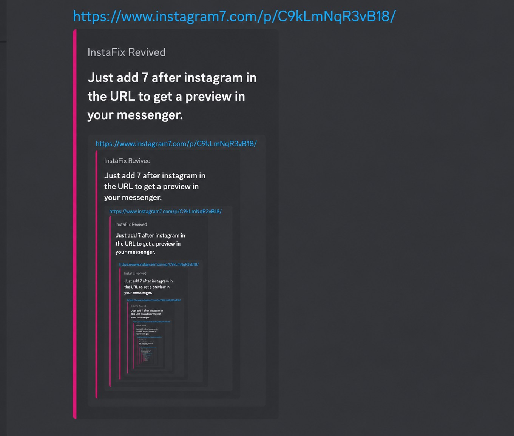

# InstaFix Revived

> Better Instagram previews for chats — public posts, Reels, thumbnails, captions, and playable media when available.

**InstaFix Revived** is a maintained, lightweight continuation of [Wikidepia/InstaFix](https://github.com/Wikidepia/InstaFix). It fixes the boring/broken Instagram embeds you often get in Telegram, Discord, Slack, WhatsApp, and other chat apps by serving cleaner OpenGraph/Twitter-card preview pages.

## Try it now

Use the public instance:

### [instagram7.com](https://www.instagram7.com/)

Just add **`7`** after `instagram` in the URL, then send the link in your messenger.

example:

```text
https://www.instagram7.com/reel/POST_ID/
```

You will see a preview in your messenger, don't need to open the instagram link.

## Preview

Add `7` to the Instagram URL and your chat app gets a cleaner embed:



## What it does

- Creates cleaner rich previews for public Instagram posts and Reels.
- Shows author, caption, thumbnail, and media metadata where available.
- Supports image and video preview routes.
- Keeps normal browser media traffic lightweight with direct redirects.
- Includes an optional local auth-helper for difficult/restricted cases.
- Includes an optional selective video proxy for preview bots, disabled by default.
- Avoids exposing direct Instagram CDN URLs in the minimal homepage JSON preview API.

## Why this exists

Instagram links often preview poorly outside Instagram. Sometimes the caption is missing, sometimes Reels do not play, and sometimes the preview is just ugly or incomplete.

InstaFix Revived sits between the chat app and Instagram, reads public metadata, and returns a small preview page with friendlier embed tags.

## Support the project

If you use the public instance at [instagram7.com](https://www.instagram7.com/) or self-host this project, a star on GitHub helps a lot.

You can also support the maintainer here:

- GitHub: [@Bl0ck154](https://github.com/Bl0ck154)
- GitHub Sponsors: [github.com/sponsors/Bl0ck154](https://github.com/sponsors/Bl0ck154)
- PayPal: [paypal.me/IlliaZabolotskyi](https://paypal.me/IlliaZabolotskyi)

## Attribution

Maintained by [Bl0ck154](https://github.com/Bl0ck154).

Derived from and inspired by [Wikidepia/InstaFix](https://github.com/Wikidepia/InstaFix).

Instagram is a trademark of Instagram, Inc. This project is independent and is not affiliated with Instagram, Meta, or Instagram, Inc.
