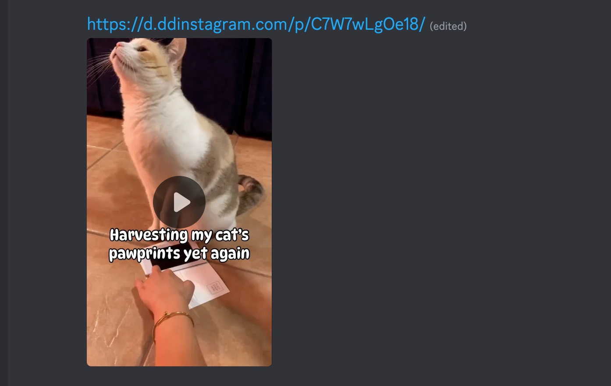
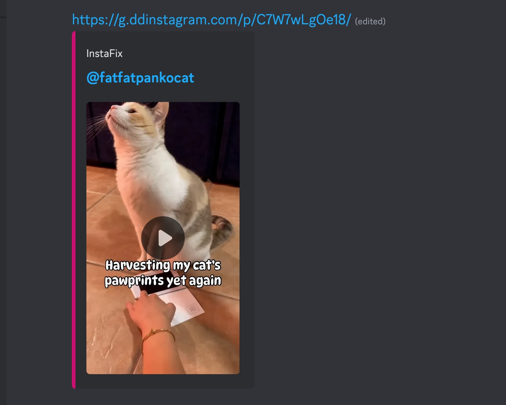

# InstaFix Revived

> Better Instagram previews for chats — public posts, Reels, thumbnails, captions, and playable media when available.

**InstaFix Revived** is a maintained, lightweight continuation of [Wikidepia/InstaFix](https://github.com/Wikidepia/InstaFix). It fixes the boring/broken Instagram embeds you often get in Telegram, Discord, Slack, WhatsApp, and other chat apps by serving cleaner OpenGraph/Twitter-card preview pages.

## Try it now

Use the public instance:

### [instagram7.com](https://www.instagram7.com/)

Just add **`7`** after `instagram` in the URL, then send the link in your messenger.

```text
https://www.instagram.com/reel/POST_ID/
```

turns into:

```text
https://www.instagram7.com/reel/POST_ID/
```

That is it — same Instagram link, but with a better preview.

> The public instance is maintained by [Bl0ck154](https://github.com/Bl0ck154). If it helps you, consider starring this repository or supporting the project.

## Preview

Add `7` to the Instagram URL and your chat app gets a cleaner embed:


## What it does

- Creates cleaner rich previews for public Instagram posts and Reels.
- Shows author, caption, thumbnail, and media metadata where available.
- Supports image and video preview routes.
- Keeps normal browser media traffic lightweight with direct redirects.
- Includes an optional local auth-helper for difficult/restricted cases.
- Includes an optional selective video proxy for preview bots, disabled by default.
- Avoids exposing direct Instagram CDN URLs in the minimal homepage JSON preview API.

## Why this exists

Instagram links often preview poorly outside Instagram. Sometimes the caption is missing, sometimes Reels do not play, and sometimes the preview is just ugly or incomplete.

InstaFix Revived sits between the chat app and Instagram, reads public metadata, and returns a small preview page with friendlier embed tags.

It is inspired by projects like `fxtwitter.com` and derived from the original [InstaFix](https://github.com/Wikidepia/InstaFix).

## Example usage

For the hosted service:

```text
instagram.com  ->  instagram7.com
www.instagram.com  ->  www.instagram7.com
```

Examples:

```text
https://www.instagram.com/p/POST_ID/
https://www.instagram7.com/p/POST_ID/
```

```text
https://www.instagram.com/reel/POST_ID/
https://www.instagram7.com/reel/POST_ID/
```

If you self-host, replace `instagram7.com` with your own domain.

## More preview modes

The original InstaFix project also showed examples for media-focused and gallery-style previews. InstaFix Revived keeps the same idea: make Instagram links easier to share and nicer to preview.

### Media-focused preview



### Gallery-style preview



## Self-host quick start

```sh
go build
./instafix -listen 127.0.0.1:3000
```

Then open:

```text
http://127.0.0.1:3000/
```

Put it behind Caddy, Nginx, Traefik, or another reverse proxy and point your own domain at it.

## Docker

```sh
docker build -t instafix-revived:local .
docker run --rm -p 3000:3000 instafix-revived:local
```

See [`docker-compose.example.yml`](./docker-compose.example.yml) for an app + optional auth-helper example.

## Optional auth helper

Most requests should use public scraping only. For content that public scraping cannot access, InstaFix Revived can optionally call a **local-only** helper service that uses `curl_cffi` and an Instagram `Cookie` header stored outside Git.

Build and run the helper:

```sh
docker build -t instafix-auth-helper:local auth-helper
docker run --rm --network host \
  -v /opt/instafix-revived/secrets/instagram_cookie:/run/secrets/instagram_cookie:ro \
  -e AUTH_HELPER_LISTEN=127.0.0.1:3200 \
  instafix-auth-helper:local
```

Start the app with:

```sh
AUTH_HELPER_URL=http://127.0.0.1:3200 ./instafix
```

`AUTH_HELPER_URL` is intentionally restricted to `http://localhost` / loopback addresses.

## Safety notes

- Do **not** commit cookies, `.env` files, tokens, logs, or production configs.
- Do **not** expose the auth helper to the public internet.
- Use conservative rate limits if authenticated fallback is enabled.
- Keep the video proxy disabled unless you really need it.
- If you enable the video proxy, restrict it to known preview clients and low concurrency.

## Support the project

If you use the public instance at [instagram7.com](https://www.instagram7.com/) or self-host this project, a star on GitHub helps a lot.

You can also support the maintainer here:

- GitHub: [@Bl0ck154](https://github.com/Bl0ck154)
- GitHub Sponsors: [github.com/sponsors/Bl0ck154](https://github.com/sponsors/Bl0ck154)
- PayPal: [paypal.me/IlliaZabolotskyi](https://paypal.me/IlliaZabolotskyi)

## Attribution

Maintained by [Bl0ck154](https://github.com/Bl0ck154).

Derived from and inspired by [Wikidepia/InstaFix](https://github.com/Wikidepia/InstaFix).

Instagram is a trademark of Instagram, Inc. This project is independent and is not affiliated with Instagram, Meta, or Instagram, Inc.
